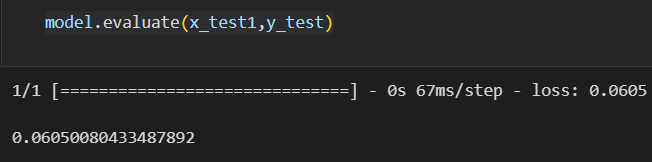

# Developing a Neural Network Regression Model

## AIM

To develop a neural network regression model for the given dataset.

## THEORY

A neural network regression model consists of multiple interconnected layers of neurons (nodes). Each neuron applies a linear transformation followed by a non-linear activation function to its input. The architecture typically includes an input layer, one or more hidden layers, and an output layer.

Input Layer: Receives the input features.
Hidden Layers: Intermediate layers between the input and output layers. Each hidden layer contains multiple neurons that perform computations.
Output Layer: Produces the predicted continuous values.

The neural network learns the relationship between the input features and the target variable by adjusting the weights and biases during training. This process involves forward propagation to compute predictions and backward propagation (backpropagation) to update the model parameters based on the prediction errors.

## Neural Network Model


## DESIGN STEPS

### STEP 1:

Loading the dataset

### STEP 2:

Split the dataset into training and testing

### STEP 3:

Create MinMaxScalar objects ,fit the model and transform the data.

### STEP 4:

Build the Neural Network Model and compile the model.

### STEP 5:

Train the model with the training data.

### STEP 6:

Plot the performance plot

### STEP 7:

Evaluate the model with the testing data.

## PROGRAM
### Name: YUVARAJ.S
### Register Number:212222240119
```python
import tensorflow as tf
import keras
import pandas as pd
data=pd.read_excel("Ex 1 Dataset.xlsx")
data.head(10)
from sklearn.model_selection import train_test_split
from sklearn.preprocessing import MinMaxScaler
from tensorflow.keras.models import Sequential
from tensorflow.keras.layers import Dense
x=data[['Input ']].values
y=data[['Output']].values
x
x_train,x_test,y_train,y_test=train_test_split(x,y,test_size=0.5,random_state=40)
Scaler = MinMaxScaler()
Scaler.fit(x_train)
X_train1 = Scaler.transform(x_train)
model=Sequential([
    Dense(5, activation="relu"),
    Dense(3, activation="relu"),
    Dense(4, activation="relu"),
    Dense(1)
])
model.compile(optimizer='adam',
              loss='mse')model.fit(
    X_train1,
    y_train,
    epochs=800
)
loss_df = pd.DataFrame(model.history.history)
loss_df.plot()
x_test1 = Scaler.transform(x_test)
model.evaluate(x_test1,y_test)
x_n1 = [[23]]
x_n1_1 = Scaler.transform(x_n1)
model.predict(x_n1_1)
```
## Dataset Information


## OUTPUT

### Training Loss Vs Iteration Plot


### Test Data Root Mean Squared Error


### New Sample Data Prediction


## RESULT

A neural network regression model for the given dataset has been developed Sucessfully.